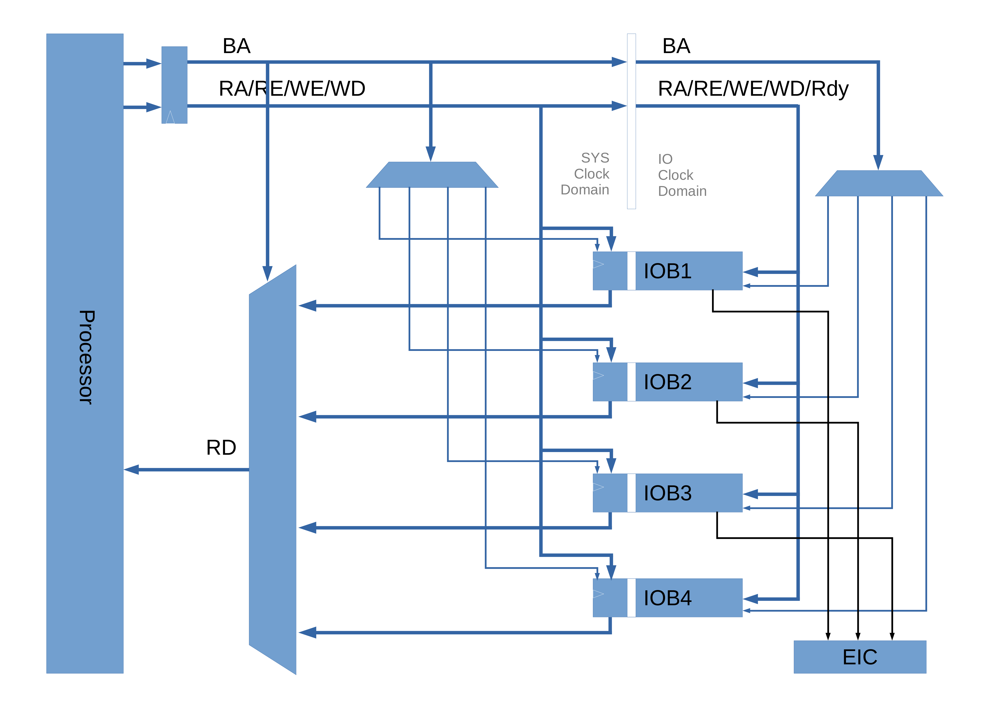
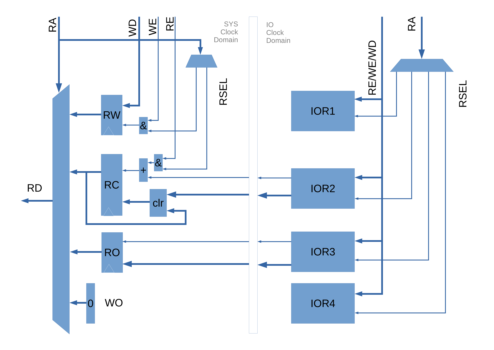
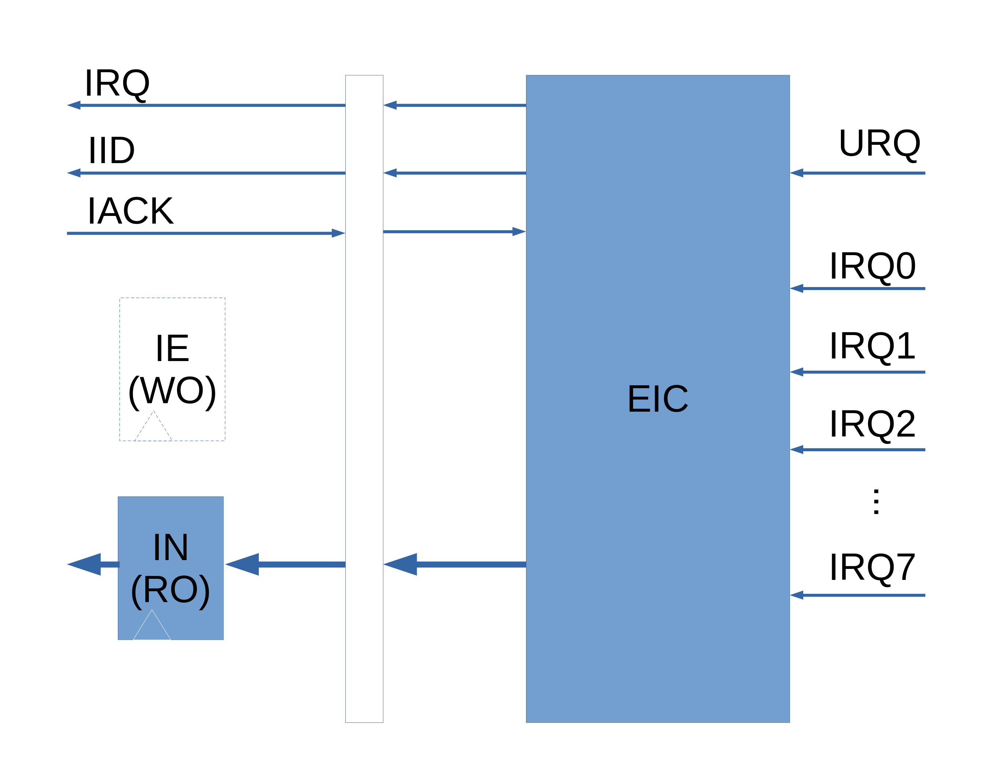

# KabIO Design

**Date:** June 1, 2018  
**Version:** 1.0d  
**Author:** Kathy  
**Reviewer:** (N/A)  

## 1 Introduction

### 1.1 Description

I/O devices of Kabeta processor.

### 1.2 I/O Interface

*Figure 1. [I/O Interface](IO_General.png)*

**NOTES:**

1. Signal Names
   - BA -- Block Address
   - RA -- Register Address
   - RE -- Read Enable
   - WE -- Write Enable
   - WD -- Write Data
   - RD -- Read Data
   - Rdy -- Ready
2. EIC is a special I/O block with interrupt interface.
### 1.3 I/O Block

*Figure 2. [I/O Block](IO_Block.png)*

**NOTES:**

- RW -- Read/Write

- RC -- Read with Clear

- RO -- Read Only

- WO -- Write Only

### 1.4 I/O Address Format 

I/O address is divided into two parts, block address and register address.

| 31            7 | 8                     6 | 5                        2 | 1  0 |
| :-------------: | :---------------------: | :------------------------: | :--: |
|   (Reserved)    |      Block Address      |      Register Address      |  00  |

### 1.5 I/O Registers

- All registers are 32-bit wide
- Four types:
  - Write Only - read data is undefined
  - Read Only - write has no effect
  - Read Clear - read the register while clear some bits, and write has no effect
  - Read Write - read back what has been written or reset value

### 1.6 Block Address Allocation

| Block Name                                  | Block Address | Block Description                    |
| ------------------------------------------- | ------------- | ------------------------------------ |
| External Interrupt Controller               | 0             | Interrupt & urgent event control     |
| Basic Key & Display                         | 1             | Keys, LEDs and seven segment display |
| Universal Asynchronous Receiver Transmitter | 2             | UART serial communication            |
| System Timer                                | 3             | A timer for system tick              |
| (Reserved)                                  | 4             | (N/A)                                |
| (Reserved)                                  | 5             | (N/A)                                |
| (Reserved)                                  | 6             | (N/A)                                |
| (Reserved)                                  | 7             | (N/A)                                |

## 2 External Interrupt Controller (EIC)

### 2.1 Description

- 8 IRQ (Interrupt ReQuest) inputs
- An URQ (Urgent ReQuest) input
- IRQ/URQ inputs are rising edge trigered
- URQ has priority over IRQs
- Fixed IRQ priorities, IR0 highest and IRQ7 lowest among IRQs
- IRQs IID=0, URQ IID=1

### 2.2 Block Diagram

*Figure 3. [External Interrupt Controller](IO_EIC.png)*

### 2.3 Registers

|         Register Name          | Reset Value | Address |   Access   |
| :----------------------------: | :---------: | :-----: | :--------: |
| Interrupt Enable Register (IE) |    (N/A)    |  0x000  | Write Only |
| Interrupt Number Register (IN) | 0x0000_0000 |  0x004  | Read Only  |

#### 2.3.1 Interrupt Enable Register (IE)

| 31            1 |  0   |
| :-------------: | :--: |
|   (Reserved)    | GIE  |

- GIE: Global Interrupt Enable

#### 2.3.2 Interrupt Number Register (IN)

| 31            3 | 2           0 |
| :-------------: | :-----------: |
|   (Reserved)    |      IN       |

- IN: Interrupt Number

### 2.4 Interrupt Sources

| Interrupt Name          | IRQ Number | Interrupt Source    |
| ----------------------- | ---------- | ------------------- |
| (Reserved)              | 0          | (N/A)               |
| (Reserved)              | 1          | (N/A)               |
| UART Error Interrupt    | 2          | UART                |
| UART Receive Interrupt  | 3          | UART                |
| UART Transmit Interrupt | 4          | UART                |
| (Reserved)              | 5          | (N/A)               |
| System Tick             | 6          | System Timer        |
| Key Press Interrupt     | 7          | Basic Key & Display |

## 3 Basic Key & Display

### 3.1 Description

- Stand-alone Keys
- LEDs
- Seven Segment Display

### 3.2 Registers

|                 Register Name                 | Reset Value | Address |   Access   |
| :-------------------------------------------: | :---------: | :-----: | :--------: |
|          LED Control Register (LEDC)          | 0x0000_0000 |  0x040  | Read Write |
| Seven Segment Display Control Register (SSDC) | 0x00FF_FFFF |  0x044  | Read Write |
|     Key & Display Interrupt Enable (KDIE)     |    (N/A)    |  0x048  | Write Only |
|          Key Status Register (KEYS)           | 0x0000_0000 |  0x04C  | Read Clear |

#### 3.2.1 LED Control Register (LEDC)

| 31             4 |  3   |  2   |  1   |  0   |
| :--------------: | :--: | :--: | :--: | :--: |
|    (Reserved)    | LED3 | LED2 | LED1 | LED0 |

- LEDn

  - 0 -- off

  - 1 -- on  

#### 3.2.2 Seven Segment Display Control Register (SSDC) 

|  31  |     30     |  29  |  28  |  27  |  26  |  25  |  24  | 23  20 | 19  16 | 15  12 | 11   8 | 7    4 | 3    0 |
| :--: | :--------: | :--: | :--: | :--: | :--: | :--: | :--: | :----: | :----: | :----: | :----: | :----: | :----: |
|  EN  | (Reserved) | DP5  | DP4  | DP3  | DP2  | DP1  | DP0  |  DIG5  |  DIG4  |  DIG3  |  DIG2  |  DIG1  |  DIG0  |

- DIGn
  - 0-9: BCD code of n-th digit, or
  - Others: turn off
- DPn
  - 0: turn off n-th decimal point
  - 1: turn on n-th decimal point
- EN
  - 0: Disable Display (turn off all digits)
  - 1: Enable Display

#### 3.2.3 Key & Display Interrupt Enable (KDIE) 

| 31            1 |  0   |
| :-------------: | :--: |
|   (Reserved)    | KIE  |

- KIE
  - 0: disable key press interrupt
  - 1: enable key press interrupt

#### 3.2.4 Key Status Register (KEYS) 

| 31            4 |  3   |  2   |  1   |  0   |
| :-------------: | :--: | :--: | :--: | :--: |
|   (Reserved)    | KEY3 | KEY2 | KEY1 | KEY0 |

- KEYn
  - 0: Key not pressed
  - 1: Key pressed

### 3.3 Interrupts

| Interrupt Name      | Interrupt Number | Condition                             |
| ------------------- | ---------------- | ------------------------------------- |
| Key Press Interrupt | 1                | A key is released after pressed down. |

## 4 Universal Asynchronous Receiver Transmitter (UART)

### 4.1 Description

- Stop bits: 1 bit, 2 bits
- Data bits: 7 bits, 8 bits
- Parity: none, odd, even
- Baud rate: 1200, 9600, 19200, 115200

### 4.2 Registers

|       Register Name        | Reset Value | Address |   Access   |
| :------------------------: | :---------: | :-----: | :--------: |
|      Control Register      | 0x0000_0000 |  0x080  | Read Write |
|      Status Regisgter      | 0x0000_0000 |  0x084  | Read Only  |
| Interrupt Control Register | 0x0000_0000 |  0x088  | Read Write |
| Interrupt Status Register  | 0x0000_0000 |  0x08C  | Read Clear |
|   Transmit Data Register   |    (N/A)    |  0x090  | Write Only |
|   Receive Data Register    | 0x0000_0000 |  0x090  | Read Only  |

#### 4.2.1 Control Register (CR)

| 31            7 | 6       5 | 4        3 |  2   |  1   |  0   |
| :-------------: | :-------: | :--------: | :--: | :--: | :--: |
|   (Reserved)    |   BAUD    |   PARITY   | SLEN | DLEN |  EN  |

- EN: transceiver enable
  - 0: disable
  - 1: enable
- DLEN: data length
  - 0: 7 bits
  - 1: 8 bits
- SLEN: stop bits length
  - 0: 1 bit
  - 1: 2bit
- PARITY: parity control
  - 00/01: none
  - 10: even
  - 11: odd
- BAUD: baud rate
  - 00: 1200 baud
  - 01: 9600 baud
  - 10: 19200 baud
  - 11: 115200 baud

**NOTES:**

- All fields except EN must be written when EN = 0, or else it has no effect on transceiver.

#### 4.2.2 Status Register (SR)

| 31             3 |  2   |  1   |  0   |
| :--------------: | :--: | :--: | :--: |
|    (Reserved)    |  PE  |  FE  | BUSY |

- BUSY: transmission or receipt is in progress.
- FE: frame error.
- PE: parity error.

**NOTES:**

- FE and PE are cleared when a byte is received without error.

#### 4.2.3 Interrupt Control Register (ICR)

| 31             3 |  2   |  1   |  0   |
| :--------------: | :--: | :--: | :--: |
|    (Reserved)    | TIE  | RIE  | EIE  |

- EIE: error interrupt enable
- RIE: receive interrupt enable
- TIE: transmit interrupt enable

**NOTES:**

- For all fields,
  -  write 0 to disable the interrupt
  - write 1 to enable the interrupt

#### 4.2.4 Interrupt Status Register (ISR)

| 31             3 |  2   |  1   |  0   |
| :--------------: | :--: | :--: | :--: |
|    (Reserved)    | TIS  | RIS  | EIS  |

- EIS: error status
- RIS: receive status
- TIS: transmit status

**NOTES:**

- The status bit will be set even if the interrupt is disabled, for the sake of polling.

#### 4.2.5 Transmit Data Register (TDR)

| 31            8 | 7                  0 |
| :-------------: | :------------------: |
|   (Reserved)    |         Data         |

**NOTES:**

- Write TDR to start transmission.

#### 4.2.6 Receive Data Register (RDR)

| 31            8 | 7                  0 |
| --------------- | -------------------- |
| (Reserved)      | Data                 |

### 4.3 Interrupts

| Interrupt Name          | Interrupt Number | Condition                |
| ----------------------- | ---------------- | ------------------------ |
| UART Error Interrupt    | 2                | Frame error/Parity error |
| UART Receive Interrupt  | 3                | Data received            |
| UART Transmit Interrupt | 4                | Data can be transmitted  |

## 5 System Timer

### 5.1 Description

A 32-bit timer for system tick.

### 5.2 Registers

|    Register Name    | Reset Value | Address |   Access   |
| :-----------------: | :---------: | :-----: | :--------: |
|  Control Register   |    (N/A)    |  0x0C0  | Write Only |
| Load Value Register |    (N/A)    |  0x0C4  | Write Only |

#### 5.2.1 Control Register (CR)

| 31            1 |  0   |
| :-------------: | :--: |
|   (Reserved)    |  EN  |

- EN: enable/disable system timer. disabled after reset.
  - 0: disable
  - 1: enable

#### 5.2.2 Load Value Register (LVR)

| 31                    0 |
| :---------------------: |
|           LV            |

- LV: load value of system timer, load into system timer every time it is enabled or overflowed.
  - System timer period is T(IO_CLK)/(LV+1).
  - It takes effect  only if system timer is disabled and LV is not zero.

### 5.3 Interrupts

| Interrupt Name | Interrupt Number | Condition              |
| -------------- | ---------------- | ---------------------- |
| System Tick    | 6                | System timer overflows |

## Appendix A: Document Version History

| Version | Date      | Editor | Reviewer | Comment                |
| ------- | --------- | ------ | -------- | ---------------------- |
| 1.0     | 5/23/2018 | Kathy  | (N/A)    | Initial version.       |
| 1.0a    | 5/28/2018 | Kathy  | (N/A)    | Add basic key display. |
| 1.0b    | 5/31/2018 | Kathy  | (N/A)    | Add UART I/O block.    |
| 1.0c    | 5/31/2018 | Kathy  | (N/A)    | Add system timer.      |
| 1.0d    | 6/1/2018  | Kathy  | (N/A)    | Modify UART registers. |