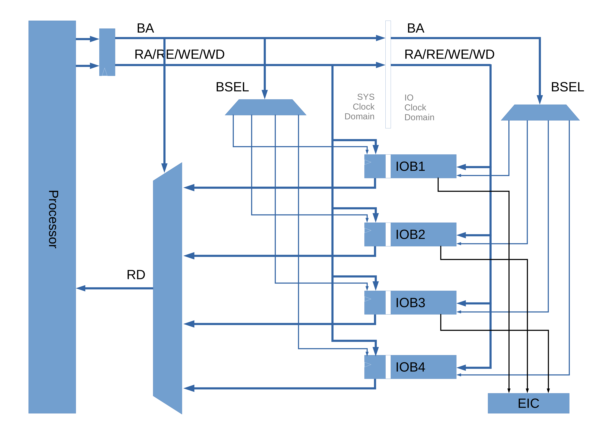

# KabIO Design

**Date:** May 23, 2018  
**Version:** 1.0  
**Author:** Kathy  
**Reviewer:** (N/A)  

## 1 Introduction

### 1.1 Description

I/O devices of Kabeta processor.

### 1.2 I/O Interface

*Figure 1. [I/O Interface](IO_General.png)*

**NOTES:**

1. Signal Names
   - BA -- Block Address
   - RA -- Register Address
   - RE -- Read Enable
   - WE -- Write Enable
   - WD -- Write Data
   - RD -- Read Data
   - Rdy -- Ready
2. EIC is a special I/O block with interrupt interface.
### 1.3 I/O Block

*Figure 2. [I/O Block](IO_Block.png)*

**NOTES:**

RW -- Read/Write

RC -- Read with Clear

RO -- Read Only

WO -- Write Only

### 1.4 I/O Address Format 

I/O address is divided into two parts, block address and register address.

| 31            7 | 8                     6 | 5                        2 | 1  0 |
| :-------------: | :---------------------: | :------------------------: | :--: |
|   (Reserved)    |      Block Address      |      Register Address      |  00  |

### 1.5 I/O Registers

- All registers are 32-bit wide
- Four types:
  - Write Only - read data is undefined
  - Read Only - write has no effect
  - Read Clear - read the register while clear some bits, and write has no effect
  - Read Write - read back what has been written or reset value

## 2 External Interrupt Controller (EIC)

### 2.1 Description

- 8 IRQ (Interrupt ReQuest) inputs
- An URQ (Urgent ReQuest) input
- IRQ/URQ inputs are rising edge trigered
- URQ has priority over IRQs
- Fixed IRQ priorities, IR0 highest and IRQ7 lowest among IRQs
- IRQs IID=0, URQ IID=1

### 2.2 Block Diagram

*Figure 3. [External Interrupt Controller](IO_EIC.png)*

### 2.3 Registers

|         Register Name          | Address |   Access   |
| :----------------------------: | :-----: | :--------: |
| Interrupt Enable Register (IE) |  0x000  | Write Only |
| Interrupt Number Register (IN) |  0x004  | Read Only  |

#### 2.3.1 Interrupt Enable Register (IE)

| 31            1 |  0   |
| :-------------: | :--: |
|   (Reserved)    | GIE  |

- GIE: Global Interrupt Enable

#### 2.3.2 Interrupt Number Register (IN)

| 31            3 | 2           0 |
| :-------------: | :-----------: |
|   (Reserved)    |      IN       |

- IN: Interrupt Number

## 3 Basic Key & Display

### 3.1 Description

- Stand-alone Keys
- LEDs
- Seven Segment Display

### 3.2 Registers

|                 Register Name                 | Reset Value | Address |   Access   |
| :-------------------------------------------: | :---------: | :-----: | :--------: |
|          LED Control Register (LEDC)          | 0x0000_0000 |  0x040  | Read Write |
| Seven Segment Display Control Register (SSDC) | 0x00FF_FFFF |  0x044  | Read Write |
|     Key & Display Interrupt Enable (KDIE)     |    (N/A)    |  0x048  | Write Only |
|          Key Status Register (KEYS)           | 0x0000_0000 |  0x04C  | Read Clear |

#### 3.2.1 LED Control Register (LEDC)

| 31             4 |  3   |  2   |  1   |  0   |
| :--------------: | :--: | :--: | :--: | :--: |
|    (Reserved)    | LED3 | LED2 | LED1 | LED0 |

- LEDn

  - 0 -- off

  - 1 -- on  

#### 3.2.2 Seven Segment Display Control Register (SSDC) 

| 31         30 |  29  |  28  |  27  |  26  |  25  |  24  | 23  20 | 19  16 | 15  12 | 11   8 | 7    4 | 3    0 |
| :-----------: | :--: | :--: | :--: | :--: | :--: | :--: | :----: | :----: | :----: | :----: | :----: | :----: |
|  (Reserved)   | DP5  | DP4  | DP3  | DP2  | DP1  | DP0  |  DIG5  |  DIG4  |  DIG3  |  DIG2  |  DIG1  |  DIG0  |

- DIGn
  - 0-9: BCD code of n-th digit, or
  - Others: turn off
- DPn
  - 0: turn off n-th decimal point
  - 1: turn on n-th decimal point

#### 3.2.3 Key & Display Interrupt Enable (KDIE) 

| 31            1 |  0   |
| :-------------: | :--: |
|   (Reserved)    | KIE  |

- KIE
  - 0: disable key press interrupt
  - 1: enable key press interrupt

#### 3.2.4 Key Status Register (KEYS) 

| 31            4 |  3   |  2   |  1   |  0   |
| :-------------: | :--: | :--: | :--: | :--: |
|   (Reserved)    | KEY3 | KEY2 | KEY1 | KEY0 |

- KEYn
  - 0: Key not pressed
  - 1: Key pressed

### 3.3 Interrupts

| Interrupt Name      | Interrupt Number | Condition                             |
| ------------------- | ---------------- | ------------------------------------- |
| Key Press Interrupt | 1                | A key is released after pressed down. |

## Appendix A: Document Version History

| Version | Date      | Editor | Reviewer | Comment          |
| ------- | --------- | ------ | -------- | ---------------- |
| 1.0     | 5/23/2018 | Kathy  | (N/A)    | Initial version. |