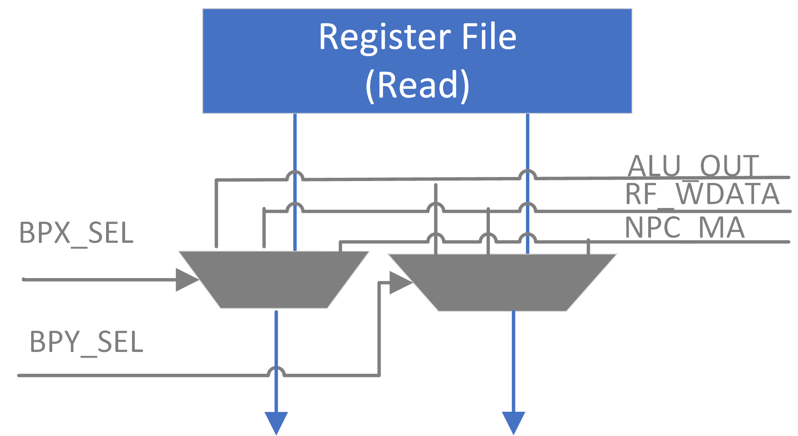

# Kabeta Processor Design

Date: April 25, 2018

Version: 1.1B

Author: Katherine White

Reviewer: (N/A)

## 1 Introduction

### 1.1	Description

Kabeta is a RISC processor based on the β Processor of MIT. Its main features and limitations include:
- Typical 5-stage Pipeline with Bypass
- Supervisor and User Modes
- Separate Instruction, Data and I/O Address Spaces
- Synchronous Single-cycle Access on-chip Instruction and Data RAMs (for the sake of implementation in FPGA)

### 1.2	Components

Kabeta mainly consists of Register File, Arithmetic and Logic Unit, Instruction Registers and Decoders, Branch and Exception Control, Address Adders, Program Counter, on-chip Data Memory and Instruction Memory.

### 1.3	Block Diagram

**NOTES:**
- ALU in the diagram should contain an output register.
- Read-while-write behavior of Register File should be write-through, i.e. the output data should be the data to be written.

### 1.4	References

- [MIT β Processor Specification](MIT6_004s09_lab_beta_doc.pdf)
- [MIT β Processor Summary](MIT6_004s09_lab_beta_summary.pdf)
- [Lecture Notes](https://ocw.mit.edu/courses/electrical-engineering-and-computer-science/6-004-computation-structures-spring-2009/lecture-notes/) of [MIT 6.004 Computation Structures](https://ocw.mit.edu/courses/electrical-engineering-and-computer-science/6-004-computation-structures-spring-2009/) ([L14](MIT6_004s09_lec14.pdf), [L22](MIT6_004s09_lec22.pdf), [L23](MIT6_004s09_lec23.pdf))

## 2 Instruction Extension

### 2.1 System Service – SVC (1C)

|    31 : 26 | 25 : 21 | 20 : 16 | 15 : 0 |
|-----------:|--------:|--------:|-------:|
| **01**1100 |   00000 |   00000 | SVC_ID |

**NOTE:** This instruction will cause System Service Trap.

### 2.2 Input/Output Read – IOR (08)

|    31 : 26 | 25 : 21 | 20 : 16 |                    15 : 0 |
|-----------:|--------:|--------:|--------------------------:|
| **00**1000 |      Rc |      Ra | Offset (two’s complement) |

Reg[Rc] ← IO[Reg[Ra] + Sext(Offset)]

**NOTE:** This is a privileged instruction.

### 2.3 Input/Output Write – IOW (09)

|    31 : 26 | 25 : 21 | 20 : 16 |                    15 : 0 |
|-----------:|--------:|--------:|--------------------------:|
| **00**1001 |      Rc |      Ra | Offset (two’s complement) |

IO[Reg[Ra] + Sext(Offset)] ← Reg[Rc]

**NOTE:** This is a privileged instruction.

## 3 Bypass

### 3.1 Bypass Paths

### 3.2 Control Signals

- Port X

  - ALU_OUT_SELX =
(IR_EX.Opcode in {OP, OPC, LD, ST, JMP, B, IOR, IOW})
&& (IR_EX.Ra != 31)
&& (IR_EX.Ra == IR_MA.Rc) && (IR_MA.Opcode in {OP, OPC})

  - NPC_MA_SELX =
(IR_EX.Opcode in {OP, OPC, LD, ST, JMP, B, IOR, IOW})
&& (IR_EX.Ra != 31)
&& (IR_EX.Ra == IR_MA.Rc) && (IR_MA.Opcode in {JMP, B})

  - RF_WDATA_SELX =
(IR_EX.Opcode in {OP, OPC, LD, ST, JMP, B, IOR, IOW})
&& (IR_EX.Ra != 31)
&& (!ALU_OUT_SELX && !NPC_MA_SELX)
&& (IR_EX.Ra == IR_WB.Rc)
&& (IR_WB.Opcode in {OP, OPC, LD, LDR, JMP, B, IOR})

- Port Y

  - ALU_OUT_SELY =
((IR_EX.Opcode in {OP}) && (IR_EX.Rb != 31)
&& (IR_EX.Rb == IR_MA.Rc) && (IR_MA.OpCode in {OP, OPC}))
|| ((IR_EX.Opcode in {ST, IOW}) && (IR_EX.Rc != 31)
&& (IR_EX.Rc == IR_MA.Rc) && (IR_MA.OpCode in {OP, OPC}))

  - NPC_MA_SELY =
((IR_EX.Opcode in {OP}) && (IR_EX.Rb != 31)
&& (IR_EX.Rb == IR_MA.Rc)
&& (IR_MA.Opcode in {JMP, B}))
|| ((IR_EX.Opcode in {ST, IOW}) && (IR_EX.Rc != 31)
&& (IR_EX.Rc == IR_MA.Rc)
&& (IR_MA.Opcode in {JMP, B}))

  - RF_WDATA_SELY =
((IR_EX.Opcode in {OP}) && (IR_EX.Rb != 31)
&& (!ALU_OUT_SELY && !NPC_MA_SELY)
&& (IR_EX.Rb == IR_WB.Rc)
&& (IR_WB.Opcode in {OP, OPC, LD, LDR, JMP, B, IOR}))
|| ((IR_EX.Opcode in {ST, IOW}) && (IR_EX.Rc != 31)
&& (!ALU_OUT_SELY && !NPC_MA_SELY)
&& (IR_EX.Rc == IR_WB.Rc)
&& (IR_WB.Opcode in {OP, OPC, LD, LDR, JMP, B, IOR}))

## 4 Pipeline Stall

Stall the pipeline when one of the source registers of the instruction at RR-Stage coincides with the target register of the load/read instruction at EX-Stage.

### 4.1 Control Signals

Stall =
((IR_RR.Opcode in {OP, OPC, LD, ST, JMP, B, IOR, IOW})  // Read Ra
&& (IR_RR.Ra != 31)
&& (IR_RR.Ra == IR_EX.Rc) && (IR_EX.Opcode in {LD, LDR, IOR}))
|| ((IR_RR.Opcode in {OP})  // Read Rb
&& (IR_RR.Rb != 31)
&& (IR_RR.Rb == IR_EX.Rc) && (IR_EX.OpCode in {LD, LDR, IOR}))
|| ((IR_RR.Opcode in {ST, IOW})  // Read Rc
&& (IR_RR.Rc != 31)
&& (IR_RR.Rc == IR_EX.Rc) && (IR_EX.Opcode in {LD, LDR, IOR}))

**NOTE:** Stall the pipeline as early as possible to disable less components.

### 4.2 Implementation

Inject NOP instruction into EX-stage and disable Register File read, PC_RR, IR_RR, PC_IF and Instruction Memory.

**NOTE:** This implementation is a bit different from MIT β Processor.

### 4.3 Mitigation

When writing programs, put an instruction independent of the data following the load/read instruction to eliminate pipeline stall.
