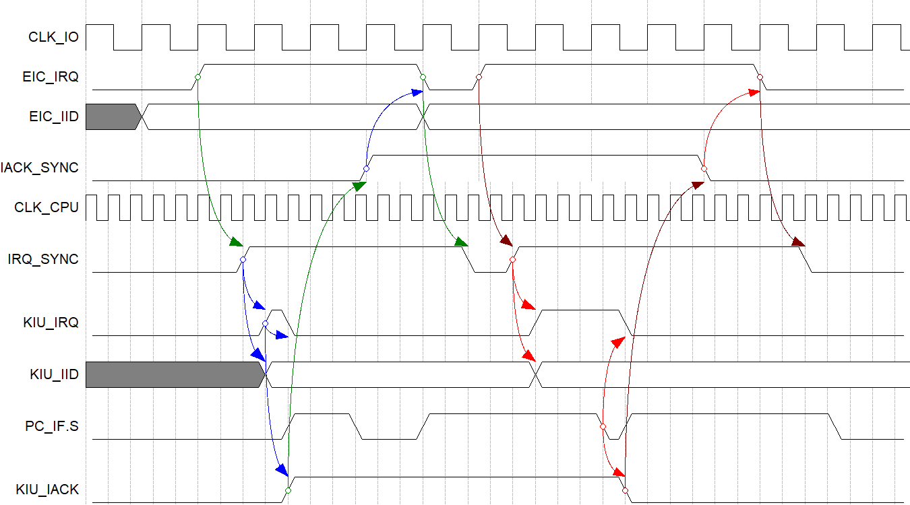

# Kabeta Processor Design

**Date:** June 4, 2018  
**Version:** 2.1A  
**Author:** Kathy  
**Reviewer:** (N/A)  

## 1 Introduction

### 1.1 Description

Kabeta is a RISC processor based on the β Processor of MIT. Its main features and limitations include:
- Typical 5-stage Pipeline with Bypass
- Supervisor and User Modes
- Separate Instruction, Data and I/O Address Spaces
- Synchronous Single-cycle Access on-chip Instruction and Data RAMs (for the sake of implementation in FPGA)

### 1.2 Components


_Figure 1. [General Block Diagram](General_Block_Diagram.png)_

Kabeta mainly consists of Register File, Arithmetic and Logic Unit, Instruction Registers and Decoders, Branch and Exception Control, Address Adders, Program Counter, on-chip Data Memory and Instruction Memory.

### 1.3 Block Diagram


_Figure 2. [Detailed Block Diagram](Detailed_Block_Diagram.png)_

**NOTES:**
- ALU in the diagram should contain an output register.
- Read-while-write behavior of Register File should be write-through, i.e. the output data should be the data to be written.

### 1.4 References

- [MIT β Processor Specification](MIT6_004s09_lab_beta_doc.pdf)
- [MIT β Processor Summary](MIT6_004s09_lab_beta_summary.pdf)
- [Lecture Notes](https://ocw.mit.edu/courses/electrical-engineering-and-computer-science/6-004-computation-structures-spring-2009/lecture-notes/) of [MIT 6.004 Computation Structures](https://ocw.mit.edu/courses/electrical-engineering-and-computer-science/6-004-computation-structures-spring-2009/) ([L14](MIT6_004s09_lec14.pdf), [L22](MIT6_004s09_lec22.pdf), [L23](MIT6_004s09_lec23.pdf))

## 2 Instruction Extension

### 2.1 System Service – SVC (1C)

|    31 : 26 | 25 : 21 | 20 : 16 |      15 : 0 |
| ---------: | ------: | ------: | ----------: |
| **01**1100 |   00000 |   00000 | 0000...0000 |

Parameters can be put in registers.

**NOTE:** This instruction will cause System Service Trap.

### 2.2 Input/Output Read – IOR (08)

|    31 : 26 | 25 : 21 | 20 : 16 |                    15 : 0 |
|-----------:|--------:|--------:|--------------------------:|
| **00**1000 |      Rc |      Ra | Offset (two’s complement) |

Reg[Rc] ← IO[Reg[Ra] + Sext(Offset)]

**NOTE:** This is a privileged instruction.

### 2.3 Input/Output Write – IOW (09)

|    31 : 26 | 25 : 21 | 20 : 16 |                    15 : 0 |
|-----------:|--------:|--------:|--------------------------:|
| **00**1001 |      Rc |      Ra | Offset (two’s complement) |

IO[Reg[Ra] + Sext(Offset)] ← Reg[Rc]

**NOTE:** This is a privileged instruction.

## 3 Pipeline Bypass

### 3.1 Bypass Paths


_Figure 3. [Bypass Paths](Bypass_Paths.png)_

### 3.2 Control Signals

#### 3.2.1 Port X

- ALU_OUT_SELX

```
ALU_OUT_SELX =
(IR_EX.Opcode in {OP, OPC, LD, ST, JMP, B, IOR, IOW})
&& (IR_EX.Ra != 31) && (IR_EX.Ra == IR_MA.Rc)
&& (IR_MA.Opcode in {OP, OPC})
```

  - NPC_MA_SELX

```
NPC_MA_SELX =
(IR_EX.Opcode in {OP, OPC, LD, ST, JMP, B, IOR, IOW})
&& (IR_EX.Ra != 31) && (IR_EX.Ra == IR_MA.Rc)
&& (IR_MA.Opcode in {JMP, B})
```

  - RF_WDATA_SELX

```
RF_WDATA_SELX =
(!ALU_OUT_SELX && !NPC_MA_SELX)
&& (IR_EX.Opcode in {OP, OPC, LD, ST, JMP, B, IOR, IOW})
&& (IR_EX.Ra != 31) && (IR_EX.Ra == IR_WB.Rc)
&& (IR_WB.Opcode in {OP, OPC, LD, LDR, JMP, B, IOR})
```

#### 3.2.2 Port Y

- ALU_OUT_SELY

```
ALU_OUT_SELY =
( /* Read Rb */
  (IR_EX.Opcode in {OP}) && (IR_EX.Rb != 31)
  && (IR_EX.Rb == IR_MA.Rc) && (IR_MA.OpCode in {OP, OPC})
)
||
( /* Read Rc */
  (IR_EX.Opcode in {ST, IOW}) && (IR_EX.Rc != 31)
  && (IR_EX.Rc == IR_MA.Rc) && (IR_MA.OpCode in {OP, OPC})
)
```

  - NPC_MA_SELY

```
NPC_MA_SELY =
( /* Read Rb */
  (IR_EX.Opcode in {OP}) && (IR_EX.Rb != 31)
  && (IR_EX.Rb == IR_MA.Rc) && (IR_MA.Opcode in {JMP, B})
)
||
( /* Read Rc */
  (IR_EX.Opcode in {ST, IOW}) && (IR_EX.Rc != 31)
  && (IR_EX.Rc == IR_MA.Rc) && (IR_MA.Opcode in {JMP, B})
)
```

  - RF_WDATA_SELY

```
RF_WDATA_SELY =
(
  !ALU_OUT_SELY && !NPC_MA_SELY
)
&&
(
  ( /* Read Rb */
    (IR_EX.Opcode in {OP})
    && (IR_EX.Rb != 31) && (IR_EX.Rb == IR_WB.Rc)
    && (IR_WB.Opcode in {OP, OPC, LD, LDR, JMP, B, IOR})
  )
  ||
  ( /* Read Rc */
    (IR_EX.Opcode in {ST, IOW})
    && (IR_EX.Rc != 31) && (IR_EX.Rc == IR_WB.Rc)
    && (IR_WB.Opcode in {OP, OPC, LD, LDR, JMP, B, IOR})
  )
)
```

## 4 Pipeline Stall

Stall the pipeline when one of the source registers of the instruction at EX-Stage coincides with the target register of the load/read instruction at MA-Stage.

### 4.1 Control Signals

```
Stall =
( /* Read Ra */
  (IR_EX.Opcode in {OP, OPC, LD, ST, JMP, B, IOR, IOW})
  && (IR_EX.Ra != 31) && (IR_EX.Ra == IR_MA.Rc)
  && (IR_MA.Opcode in {LD, LDR, IOR})
)
||
( /* Read Rb */
  (IR_EX.Opcode in {OP})
  && (IR_EX.Rb != 31) && (IR_EX.Rb == IR_MA.Rc)
  && (IR_MA.OpCode in {LD, LDR, IOR})
)
||
( /* Read Rc */
  (IR_EX.Opcode in {ST, IOW})
  && (IR_EX.Rc != 31) && (IR_EX.Rc == IR_MA.Rc)
  && (IR_MA.Opcode in {LD, LDR, IOR})
)
```

**NOTE:** Stall the pipeline as early as possible to disable less components.

### 4.2 Implementation

Inject NOP instruction into MA-stage and disable Register File read, PC_RR, IR_RR, PC_IF, PC_EX, IR_EX and Instruction Memory.

**NOTE:** This implementation is a bit different from MIT β Processor.

### 4.3 Mitigation

When writing programs, put an instruction independent of the data following the load/read instruction to eliminate pipeline stall.

## 5 Exception

### 5.1 Reference

Refer to Section 6. Extensions for Exception Handling in [MIT β Processor Specification](MIT6_004s09_lab_beta_doc.pdf).

### 5.2 Supported Exceptions

| Name                | Code | Type      | Source             | Priority    | Exc. Vector |
| ------------------- | ---- | --------- | ------------------ | ----------- | ----------- |
| Reset               | 000  | Reset     | RST Pin            | 0 (highest) | 8000_0000   |
| System Service      | 001  | Trap      | RR-Stage           | 3           | 8000_0004   |
| Illegal Instruction | 010  | Fault     | RR-Stage           | 3           | 8000_0008   |
| Invalid Operation   | 011  | Fault     | EX-Stage           | 2           | 8000_000C   |
| Invalid D-Address   | 100  | Fault     | MA-Stage           | 1           | 8000_0010   |
| Invalid I-Address   | 101  | Fault     | IF-Stage, MA-Stage | 4           | 8000_0014   |
| Interrupt 0         | 110  | Interrupt | IRQ Pin            | 5 (lowest)  | 8000_0018   |
| Interrupt 1         | 111  | Interrupt | IRQ Pin            | 5 (lowest)  | 8000_001C   |

**NOTES:**

- The MSBs of exception vectors indicate that the exceptionhandlers will executed in the Supervisor Mode.
- If instructions at multiple stages have causedexceptions simultaneously, only the exception in the highest priority should beprocessed.
- Pay attention to the suppression of exceptions bythe branch instruction in EX-Stage, refer to Section 6.2.

### 5.3 Exception Conditions

| Name                | Condition                                                    |
| ------------------- | ------------------------------------------------------------ |
| Reset               | External reset signal (active LOW)                           |
| System Service      | SVC instruction                                              |
| Illegal Instruction | Undefined opcodes (6’b010_xxx, 6’b011_010) in both modes,  privileged opcodes (6’b00x_xxx) in User Mode,  or undefined privileged opcodes in Supervisor Mode. |
| Invalid Operation   | Undefined Operate Class Opcodes, MUL/MULC, or DIV/DIVC       |
| Invalid D-Address   | Out of data memory address range                             |
| Invalid I-Address   | Out of instruction memory address range                      |
| Interrupt 0/1       | External interrupt signal                                    |

### 5.4 Interrupt Request and Acknowledge

- External interrupts are level triggered.
- Interrupt number is read from IID pin.
- Acknowledge is a pulse of one clock cycle’s duration.

**NOTE:** The above signals (IRQ, IID and IACK) cross clock domains.


_Figure 4. [Interrupt Request and Acknowledge Timing Diagram](Interrupt_Req_Ack_Timing_Diagram.png)_

### 5.5 Implementation

When BNE(R31,0,XP) instruction arrives at WB-Stage, write register XP <= PC_WB, which is the instruction address plus 4.

#### 5.5.1 Reset Processing

- Reset all Instruction Registers (i.e. load NOPs).
- Reset all Program Counters (i.e. load 32’h0000_0000 address).
- Set ExcAddr <= reset exception vector, and select ExcAddr as next PC value.

**NOTE:** Synchronization of external RST signal is necessary.

####  5.5.2 Trap and Fault Processing

When a trap or fault occurs:
- Replace the instruction which has caused the exception with BNE(R31,0,XP) instruction.
- Replace the later instructions in the pipeline with NOP instructions.
- Jump to the exception handler.

**NOTE:** Traps and Faults could be nested, as long as XP is stored onto stack in the exception handlers.

#### 5.5.3 Interrupt Processing

When an interrupt occurs:
- Wait until Supervisor bit is cleared (i.e. PC_IF.S == 0).
- Replace the instruction at EX-Stage with BNE(R31,0,XP) instruction.
- Replace the instructions at IF-Stage and RR-Stage with NOP instructions.
- Jump to the exception handler.

**NOTE:** Interrupts could not be nested with other exceptions. (Because PC_IF.S will be set when the first instruction of the IRQ handler is fetched.)

## 6 Branch

### 6.1 Branch Delay Slots

There are 2 branch delay slots. The instructions in the branch delay slots will be flushed by asserting FlushIF and FlushRR, and corresponding PCs will be replaced with PC_EX (i.e. the address of the branch instruction plus 4) by asserting ReplicatePC, if the branch is taken.

### 6.2 Exception Suppression

When branch instruction is at EX-Stage and branch is taken, the Traps and Faults caused by the instructions in the branch delay slots will be ignored.

### 6.3 Supervisor Mode
Only the JMP instruction is allowed to clear the Supervisor bit but not set it, and no other instructions may have any effect on it. If JMP tries to switch to Supervisor Mode from User Mode, the S bit will be ignored and no exception will be caused.

## 7 Components Signaling

### 7.1 Instruction Decoder Signaling

| Stage | Signal            | OP     | OPC    | LD   | IOR  | ST   | IOW  | JMP  | BEQ  | BNE  | LDR  | SVC  |
| ----- | ----------------- | ------ | ------ | ---- | ---- | ---- | ---- | ---- | ---- | ---- | ---- | ---- |
| IF    | (N/A)             |        |        |      |      |      |      |      |      |      |      |      |
| RR    | RegAddrYSel       | RB     | X      | X    | X    | RC   | RC   | X    | X    | X    | X    | X    |
|       | RegRdEnX          | 1      | 1      | 1    | 1    | 1    | 1    | 1    | 1    | 1    | 0    | 0    |
|       | RegRdEnY          | 1      | 0      | 0    | 0    | 1    | 1    | 0    | 0    | 0    | 0    | 0    |
| EX    | BrCond [1]        | NV     | NV     | NV   | NV   | NV   | NV   | AL   | EQ   | NE   | NV   | NV   |
|       | InstrMemAddrBufEn | 0      | 0      | 0    | 0    | 0    | 0    | 0    | 0    | 0    | 1    | 0    |
|       | ALU_DataYSel [2]  | REG    | LIT    | LIT  | LIT  | LIT  | LIT  | X    | X    | X    | X    | X    |
|       | MemDataBufEn      | 0      | 0      | 0    | 0    | 1    | 1    | 0    | 0    | 0    | 0    | 0    |
|       | ALU_Op            | ALU_Op | ALU_Op | ADD  | ADD  | ADD  | ADD  | X    | X    | X    | X    | X    |
|       | ALU_En            | 1      | 1      | 1    | 1    | 1    | 1    | 0    | 0    | 0    | 0    | 0    |
| MA    | InstrMemRdEn      | 0      | 0      | 0    | 0    | 0    | 0    | 0    | 0    | 0    | 1    | 0    |
|       | Mem_Ren           | 0      | 0      | 1    | 0    | 0    | 0    | 0    | 0    | 0    | 0    | 0    |
|       | Mem_Wen           | 0      | 0      | 0    | 0    | 1    | 0    | 0    | 0    | 0    | 0    | 0    |
|       | IO_Ren            | 0      | 0      | 0    | 1    | 0    | 0    | 0    | 0    | 0    | 0    | 0    |
|       | IO_Wen            | 0      | 0      | 0    | 0    | 0    | 1    | 0    | 0    | 0    | 0    | 0    |
|       | ALU_DataBufEn     | 1      | 1      | 0    | 0    | 0    | 0    | 0    | 0    | 0    | 0    | 0    |
| WB    | RegDataWSel [3]   | ALU    | ALU    | MEM  | IO   | X    | X    | PC   | PC   | PC   | IM   | X    |
|       | RegWen            | 1      | 1      | 1    | 1    | 0    | 0    | 1    | 1    | 1    | 1    | 0    |

**NOTES:**

- ‘X’ means Don’t Care.

**NOTES:**

1. BrCond:
   - NV – Do not take
   - AL – Take unconditionally
   - EQ – Take if equal
   - NE – Take if inequal
2. ALU_DataYSel
   - REG - Register file
   - LIT - Extended literal
3. RegDataWSel:
   - PC – PC+4
   - ALU – ALU Data Buffer
   - MEM – Data Memory
   - IO – IO Registers
   - IM – Instruction Memory

### 7.2 Branch and Exception Control Signaling

| Exc.  Req.  &&  Cond. | RESET         | ExcReqMA       | IRQ_Int [4]  & (~PC_IF.S) | ExcReqEX       | Stall | BrTaken [3]                                            | ExcReqRR       | ExcReqIF       | (Default) |
| --------------------- | ------------- | -------------- | ------------------------- | -------------- | ----- | ------------------------------------------------------ | -------------- | -------------- | --------- |
| Exc.  Code            | (N/A)         | ExcCodeMA      | (N/A)                     | ExcCodeEX      | (N/A) | (N/A)                                                  | ExcCodeRR      | ExcCodeIF      |           |
| Priority              | 0 (Highest)   | 1              | 5                         | 2              | 6     | 7  (Lowest)                                            | 3              | 4              |           |
| **ExcAddr**           | 32’h8000_0000 | EVT[ExcCodeMA] | EVT[{2’b11,IID}]          | EVT[ExcCodeEX] | X     | X                                                      | EVT[ExcCodeRR] | EVT[ExcCodeIF] | X         |
| **PC_Sel [1]**        | EXCA          | EXCA           | EXCA                      | EXCA           | X     | REGA (AL), PCLIT ((EQ and RaZero) or (NE and !RaZero)) | EXCA           | EXCA           | PCNX      |
| **FlushIF**           | 0             | 1              | 1                         | 1              | 0     | 1                                                      | 1              | 1              | 0         |
| **ExcAckIF [2]**      | 0             | 0              | 0                         | 0              | 0     | 0                                                      | 0              | 1              | 0         |
| **FlushRR**           | 0             | 1              | 1                         | 1              | 0     | 1                                                      | 1              | 0              | 0         |
| **ExcAckRR [2]**      | 0             | 0              | 0                         | 0              | 0     | 0                                                      | 1              | 0              | 0         |
| **FlushEX**           | 0             | 1              | 1                         | 1              | 1     | 0                                                      | 0              | 0              | 0         |
| **ExcAckEX [2]**      | 0             | 0              | 1                         | 1              | 0     | 0                                                      | 0              | 0              | 0         |
| **FlushMA**           | 0             | 1              | 0                         | 0              | 0     | 0                                                      | 0              | 0              | 0         |
| **ExcAckMA [2]**      | 0             | 1              | 0                         | 0              | 0     | 0                                                      | 0              | 0              | 0         |
| **ReplicatePC**       | 0             | 0              | 0                         | 0              | 0     | 1                                                      | 0              | 0              | 0         |
| **Sys_Stall**         | 0             | 0              | 0                         | 0              | 1     | 0                                                      | 0              | 0              | 0         |

**NOTES:**

- ‘X’ means Don’t Care.

**NOTES:**

1. PC_Sel
   - EXCA – Exception Address
   - PCNX – PC+4
   - PCLIT – PC+4+4*Sext(Literal)
   - REGA – Register Ra
2. ExcAck*
   - 0 – Select NOP
   - 1 – Select BNE
3. BrTaken =  
    (BrCond == AL)  
    || ((BrCond == EQ) && RaZero)  
    || ((BrCond == NE) && !RaZero)  
4. IRQ_Int is the internal status if IRQ pin.


## Appendix A: Document Version History

| Version | Date      | Editor | Reviewer | Comment                                                      |
| ------- | --------- | ------ | -------- | ------------------------------------------------------------ |
| 1.0     | 4/11/2018 | Kathy  | (N/A)    | Initial version.                                             |
| 1.0B    | 4/12/2018 | Kathy  | Dao      | 1) Elaborate top level block diagram.  2) Replace NOP with BNE(R31,0,XP).   3) Put detailed block diagram into this document. |
| 1.1     | 4/15/2018 | Kathy  | (N/A)    | Add decoder signaling table.                                 |
| 1.1A    | 4/17/2018 | Kathy  | (N/A)    | Add branch and exception signaling table.                    |
| 1.1B    | 4/25/2018 | Kathy  | (N/A)    | Add interrupt request and acknowledge timing diagram.        |
| 1.1C    | 4/28/2018 | Kathy  | (N/A)    | Reformat this document in Markdown format.                   |
| 1.1D    | 5/13/2018 | Kathy  | Dao      | Correct decoder signaling table.                             |
| 1.1E    | 5/16/2018 | Kathy  | (N/A)    | Change Mem/IO control signals.                               |
| 1.1F    | 5/20/2018 | Kathy  | (N/A)    | Remove SVC_ID from SVC format.                               |
| 2.1A    | 6/4/2018  | Kathy  | (N/A)    | 1) Correct stall process for RR & EX stages. 2) Change priorities of faults, interrupts, stall and branch. |
